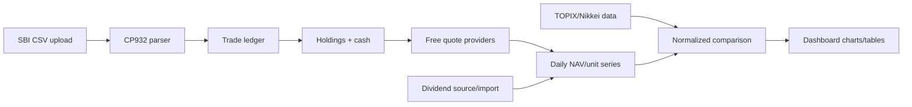

# Portfolio Dashboard Design

Date: 2026-06-23

## Goal

Build a local npm web app that imports the user's SBI execution-history CSV and displays current portfolio value, fund-style performance, dividends, daily changes, and quarterly returns compared with TOPIX and Nikkei 225.

The app is free-first: it may use free public APIs or public quote endpoints, but it must not require a paid data subscription. When free data is delayed, missing, or unreliable, the UI must say so clearly.

## Current Inputs

- `SaveFile_000001_000090.csv` is a CP932/Shift-JIS encoded SBI `約定履歴照会` export.
- The file contains 90 trade rows from 2026-01-26 through 2026-06-17.
- It contains buy/sell executions only. It does not contain daily portfolio valuations, dividends, benchmark prices, cash deposits, or cash withdrawals.
- Current codes include `6846` traded on `名証`, which must be retained and valued if quote data can be found.

## Product Scope

### In Scope

- Import a local broker CSV and parse Japanese headers.
- Treat the CSV as the portfolio ledger until the user imports a new CSV.
- Aggregate holdings from buys and sells by security code, market, and name.
- Include `6846 / 名証 / 中央製作所` in holdings, return calculations, allocation, and missing-data warnings.
- Fetch best-effort free price data for current holdings and benchmarks.
- Compare portfolio performance with TOPIX and Nikkei 225.
- Show daily portfolio change when current/latest prices are available.
- Show quarterly return compared with benchmarks.
- Show dividends when available from free sources or user-provided imports; otherwise show a clear unavailable/estimated state.
- Run locally as an npm web app.

### Out of Scope

- Paid JPX real-time feeds.
- Guaranteed true exchange real-time data for all Japanese listings.
- Automatic brokerage login/scraping.
- Tax-lot accounting for tax filing.
- Multi-currency foreign holdings unless added by a later CSV format.
- Server-hosted multi-user deployment.

## Key Data Decisions

### CSV Is the Ledger

The imported CSV is the source of truth for trades. Holdings do not change unless the user imports a newer CSV.

Each execution row maps to:

```ts
type Trade = {
  tradeDate: string;
  settlementDate: string;
  code: string;
  name: string;
  market: string;
  side: "buy" | "sell";
  quantity: number;
  price: number;
  grossAmount: number;
};
```

### Holding Identity

The CSV `市場` field is an execution venue. The parser must preserve it on each trade, but holding aggregation should key by `code + canonicalHoldingMarket`.

Canonical holding market rules for the MVP:

- `名証` stays `名証`.
- `東証`, `東証（外）`, and `PTS...` execution venues collapse to `東証`.
- Unknown markets keep their raw market text and emit warnings only if position quantities cannot be reconciled.

This prevents regional listings like `6846 / 名証` from being collapsed into an assumed Tokyo listing while still letting normal Tokyo-listed securities bought through PTS or outside-TSE executions settle into one holding.

Display labels should use:

```txt
6846 中央製作所 (名証)
```

### Fund-Style Performance

The app should treat the portfolio like a fund:

- Buys and sells are internal portfolio activity.
- Selling a stock increases portfolio cash.
- Realized gains and losses remain inside portfolio NAV.
- Portfolio value is `cash + market value of holdings + receivables if modeled`.
- Performance is measured by NAV/unit value, not by realized P&L alone.
- External deposits/withdrawals are the only cash flows that should affect fund units.

Because the current CSV does not contain deposits or withdrawals, the MVP should infer a synthetic starting cash contribution large enough to fund the trades, then keep subsequent sells as cash inside the portfolio. The UI must label this as an inferred cash model.

### Unit Accounting

The performance engine should maintain an internal fund unit series:

- Initial unit price starts at `100`.
- External contribution creates units at the current unit price.
- External withdrawal redeems units at the current unit price.
- Internal trades do not create or redeem units.
- Daily unit NAV is `total NAV / units outstanding`.
- Portfolio return for any period is `ending unit NAV / starting unit NAV - 1`.

This supports fair comparison with TOPIX and Nikkei 225.

## Market Data Strategy

### Free-First Quote Sources

The app should implement a quote-provider interface so sources can be swapped without changing portfolio logic.

```ts
type Quote = {
  code: string;
  market: string;
  price: number | null;
  currency: "JPY";
  asOf: string | null;
  source: string;
  status: "live-ish" | "delayed" | "stale" | "manual" | "missing";
  message?: string;
};
```

Initial provider order:

1. Free public quote endpoint for regular Tokyo-listed Japanese equities.
2. Free benchmark endpoint for TOPIX and Nikkei 225.
3. Special-case regional listing lookup for holdings such as `6846 / 名証` if available.
4. Manual price override stored locally when no free quote is available.

The UI must not silently drop a holding with missing quote data. It should carry the holding forward at cost or last known/manual price and show a warning.

### Benchmarks

Use normalized benchmark return series:

- TOPIX
- Nikkei 225

Benchmark charts should normalize all series to `100` at the selected start date.

### Real-Time Expectations

The app should call this "latest available price" rather than promising official real-time data. Free sources may be delayed, stale, or unavailable. The dashboard should show freshness next to the total NAV and per holding.

## Dividend Strategy

The current CSV does not include dividends. The MVP should support three states:

1. **Confirmed dividends:** imported from a later dividend CSV or free source with payment/ex-dividend information.
2. **Estimated dividends:** derived from free dividend data when available.
3. **Unavailable:** shown clearly when the app cannot fetch or infer dividends.

Dividend display:

- Year-to-date dividends.
- Dividends by quarter.
- Dividend yield on current market value where possible.
- Dividend contribution to total return when confirmed or estimated.

## User Interface

The first screen should be the actual dashboard, not a landing page.

### Top Bar

- CSV import button.
- Last imported file name/date.
- Refresh quotes button.
- Quote freshness indicator.

### Summary Strip

- Current NAV.
- Daily change in yen and percent.
- Total return since first trade.
- Quarterly return.
- Cash balance.
- Missing/stale quote count.

### Main Chart

An interactive line chart showing:

- Portfolio unit NAV normalized to `100`.
- TOPIX normalized to `100`.
- Nikkei 225 normalized to `100`.

Controls:

- Date range: since inception, YTD, 1M, 3M, custom.
- Toggle dividends on/off when dividend data exists.

### Holdings Table

Columns:

- Code
- Name
- Market
- Quantity
- Average cost
- Latest price
- Market value
- Unrealized P&L
- Allocation
- Quote status

`6846 / 名証` must remain visible even when quote status is `missing` or `manual`.

### Quarterly Return Table

Rows by quarter:

- Portfolio return
- TOPIX return
- Nikkei 225 return
- Portfolio vs TOPIX
- Portfolio vs Nikkei 225
- Dividend contribution if available

### Dividends Panel

- YTD dividends.
- Quarterly dividends.
- Upcoming/estimated dividends if a free source can provide them.
- Clear "No dividend data imported/found" empty state.

## Architecture

Use Vite + React + TypeScript.

Suggested libraries:

- `papaparse` or native parsing for CSV after CP932 decoding.
- `encoding-japanese` or `iconv-lite` for CP932 decoding in browser or local server.
- `recharts` or `visx` for charts.
- `date-fns` for date handling.
- `vitest` for unit tests.

### Modules

```txt
src/data/parseSbiCsv.ts
  Decode and parse SBI execution-history CSV into Trade[].

src/portfolio/positions.ts
  Aggregate trades into holdings and cash movements.

src/portfolio/nav.ts
  Build daily fund-style NAV/unit return series.

src/market/quoteProvider.ts
  Quote provider interface and free-source orchestration.

src/market/benchmarks.ts
  Fetch and normalize TOPIX/Nikkei 225 benchmark series.

src/dividends/dividends.ts
  Normalize imported/fetched dividend data.

src/components/*
  Dashboard UI components.
```

## Data Flow



## Error Handling

- Invalid encoding: show "Could not decode as CP932/SBI export."
- Missing required headers: show expected SBI columns.
- Unknown trade type: skip row and report count.
- Sell quantity greater than held quantity: keep parsing but flag the holding and NAV model as incomplete.
- Missing quote: keep holding visible; use cost/last manual price if available and mark quote `missing`.
- Stale quote: display timestamp and status.
- Benchmark unavailable: show portfolio chart without that benchmark and display a warning.

## Testing Strategy

Use TDD for implementation.

Core tests:

- Parses CP932 SBI CSV headers and rows.
- Maps `株式現物買` and `株式現物売` correctly.
- Preserves `6846 / 名証`.
- Aggregates multiple executions in the same code.
- Sells increase cash and reduce holdings.
- Realized gains remain inside NAV.
- Unit NAV does not change units for internal trades.
- Quarterly return uses unit NAV return.
- Missing quote does not remove a holding.
- Benchmark normalization starts each series at `100`.

## Open Risks

- Free quote sources may change or block browser requests. The quote layer should be isolated so a local proxy or alternate source can be added later.
- Regional exchange coverage for `6846 / 名証` may be incomplete. The app must support manual latest-price override for this case.
- Dividends may need a separate import path if free sources do not provide reliable coverage.
- The current trade CSV alone cannot distinguish external deposits from a pre-funded cash account. The MVP uses inferred cash and labels that assumption.

## References

- SEC Investor.gov defines net asset value as assets minus liabilities and notes NAV changes daily as assets and liabilities change: https://www.investor.gov/introduction-investing/investing-basics/glossary/net-asset-value
- CFA/GIPS guidance favors time-weighted returns for comparability when external cash flows exist: https://www.cfainstitute.org/insights/professional-learning/refresher-readings/2026/overview-of-the-global-investment-performance-standards
- JPX states real-time market data is a paid service: https://www.jpx.co.jp/english/markets/paid-info-equities/realtime/index.html
- JPX describes J-Quants as an individual-investor API for historical stock prices, listed company information, and dividends: https://www.jpx.co.jp/english/markets/other-data-services/j-quants-api/index.html
- J-Quants help notes free-plan delays and TSE-only stock coverage: https://jpx-jquants.com/en/help/data
- TradingView lists `6846` as a Nagoya Stock Exchange symbol: https://www.tradingview.com/symbols/NAG-6846/
